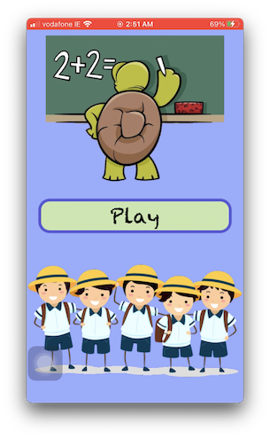
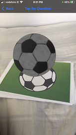
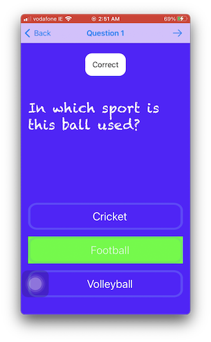
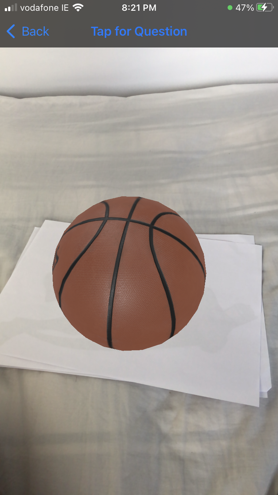
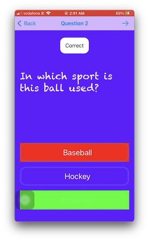
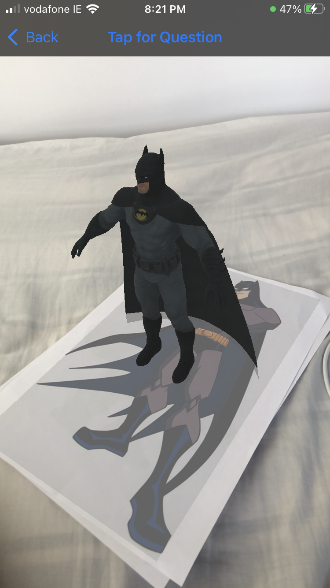
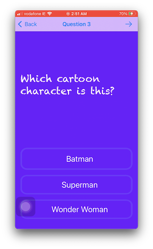
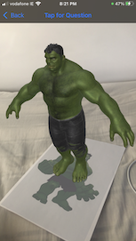
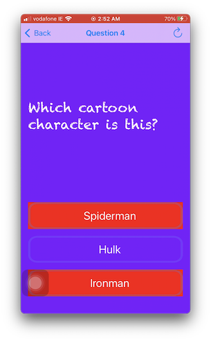

# Trivia AR Application

## About the App

This is an iOS application that I created as a small personal project to explore features of Augmented Reality more. I learned about image tracking while making this app.

This is a trivia game designed with an aim to teach kids. Showing them things in AR and asking questions based on the models. It is interactive and they can replay the game once they reach the last question.

## Working

It detects the image stored in the assets and renders a model that is assigned to that image.

## Screenshots

